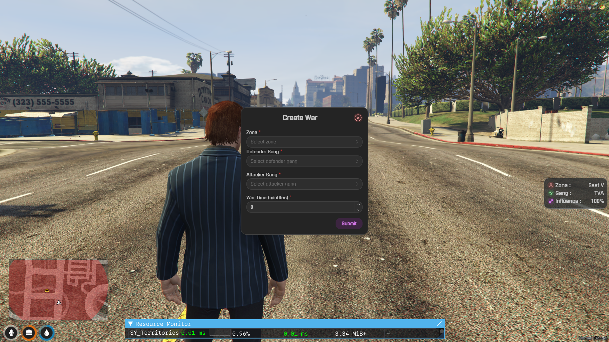
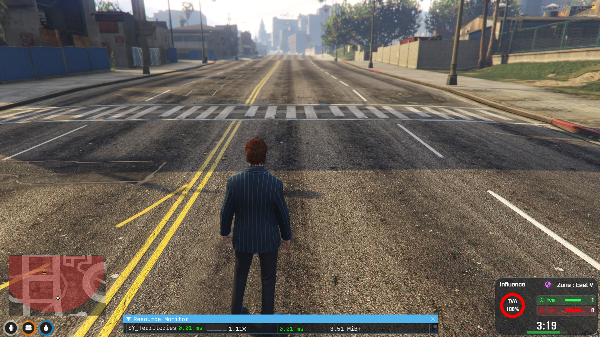

# SY_Territories V3.0
# WIP

# INFO
Territories will aim to provide gangs with "zones" to control.
Each zone will be controlled by influencing the area through various activites, including:
  - Killing other gang members.

The gang that controls the area will have access to the zones resources.






``` lua
-- Will change it in future
-- qb-ambulancejob/server.lua
RegisterNetEvent('hospital:server:SetLaststandStatus', function(bool)
	local src = source
	local Player = QBCore.Functions.GetPlayer(src)
	if Player then
		Player.Functions.SetMetaData('inlaststand', bool)
		TriggerEvent("SY_Territories:Server:OnPlayerDead", src)
	end
end)
```

# Exports
```lua
-- Use it for other gang jobs for handling and accessing the job
local ZoneName = "eastv"
local zoneData = exports["SY_Territories"]:GetZoneData(ZoneName)
if not zoneData or not QBCore.Functions.GetPlayerData().gang then
    return
end
local canAccessZone = (zoneData.gang == QBCore.Functions.GetPlayerData().gang.name)
if canAccessZone then
    if IsControlJustReleased(0, 38) then
        --    Logic
        return
    end
else
    -- Logic for non-access
    return
end
```

- click confirm
  - 30 sec cool off time (ui should show)
  - if influence of the defender not 100 then set it to 100 
  - war started announcement after 30sec cool off time
  <!-- - Creating export to check the influence from other resource  -->
  <!-- - UI only for showing influence and zone and gang -->

